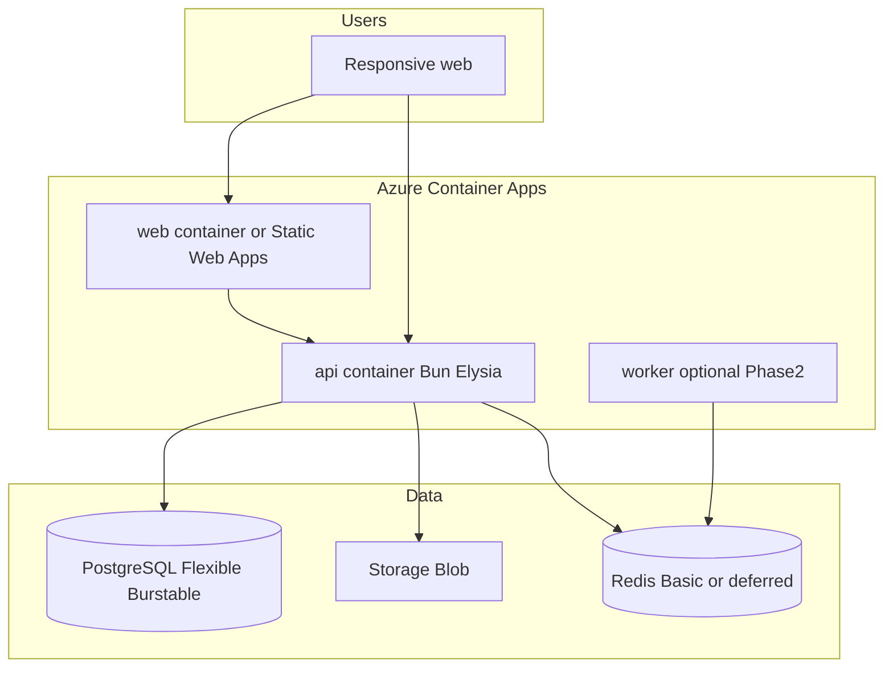

# DevOps — SocietyHub (Azure)

Infrastructure and deployment assets for **staging** and **production** on **Azure**, with a **cost-saving** bias and **Docker**-based packaging.

## When this is used

| Phase | What happens |
|-------|----------------|
| **Now (Spec + Phase 1 development)** | Keep this folder as the source of truth for how we will deploy. Flesh out Dockerfiles when `apps/api` and `apps/web` exist. **Do not** provision paid Azure production until Phase 1 app is ready. |
| **After Phase 1 development** | Provision staging → deploy containers → pilot UAT → then production. |
| **Phase 2 product** | Scale workers, Redis, payments webhooks; still prefer Container Apps over AKS. |

Product Phase 1 = complaint-portal MVP ([PRD](../SocietyHub-Spec-v0.1/docs/02-PRD.md)).  
Deployment of Phase 1 is a **follow-on DevOps phase**, not part of coding the first features.

## Folder layout

```text
devops/
  README.md                 ← this file
  COST.md                   ← cost-saving principles and SKU choices
  docker/
    README.md               ← container strategy
    api.Dockerfile          ← template for apps/api (finalize during build)
    web.Dockerfile          ← template for apps/web static/nginx
    docker-compose.yml      ← local/dev compose (Postgres, Redis, api, web)
    .dockerignore
  azure/
    README.md               ← subscription, resource groups, naming
    staging.md              ← staging env topology + cheaper SKUs
    production.md           ← production env topology + HA/backup minimums
    secrets.md              ← Key Vault / env vars (no secrets in git)
  github-actions/
    README.md               ← CI/CD plan (enable after Phase 1 code exists)
    deploy-staging.yml.example
    deploy-production.yml.example
```

## Target architecture (cost-aware)

Prefer **Azure Container Apps** (consumption, scale-to-zero on staging) over AKS or always-on large App Service plans.



## Environments

| Env | Purpose | Cost posture |
|-----|---------|--------------|
| **staging** | Integration + pilot dry-run | Smallest SKUs; scale-to-zero; stop DB outside hours if possible |
| **production** | Keshav Heights / live | Slightly larger; backups on; still avoid AKS |

Details: [azure/staging.md](azure/staging.md), [azure/production.md](azure/production.md), [COST.md](COST.md).

## Docker approach (summary)

- Build **API** and **web** as separate images from monorepo context.
- Same images promoted **staging → production** (tag by git SHA).
- Local: `docker compose` with Postgres (+ Redis when needed).
- See [docker/README.md](docker/README.md).

## Out of scope in this folder (for now)

- Live Azure resource creation / Terraform apply (do after Phase 1 code)
- Kubernetes / AKS
- Multi-region active-active
