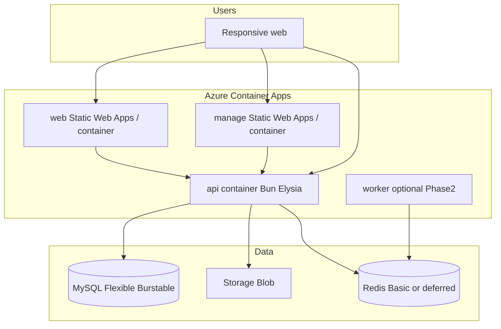

# DevOps — SocietyHub

Infrastructure and deployment for SocietyHub. **Now:** free preview on **Render**. **Later (paid):** Azure after Phase 1 UAT.

## Free preview (Render) — use this now

$0 Hobby workspace. Terraform in [`terraform/render/`](terraform/render/). Limits: [`render/LIMITATIONS.md`](render/LIMITATIONS.md).

| Piece | Where |
|-------|--------|
| API | Render free Docker web service (`devops/docker/api.Dockerfile`) |
| Client + Manage | Render static sites (Vite `dist/`) |
| Database | TiDB Serverless (MySQL protocol) — not Render Postgres |
| CI | `.github/workflows/ci.yml` on `staging` / `main` |
| CD preview | Promote `staging` → `main` → Render auto-deploy ([PIPELINE.md](PIPELINE.md)) |

**Do not** provision Azure until UAT. **Do not** add a Render card or pick Pro.

## When Azure is used

| Phase | What happens |
|-------|----------------|
| **Now (Spec + Phase 1 development)** | Keep `azure/` as the paid target. Run the Render preview instead. |
| **After Phase 1 UAT** | Provision Azure staging → deploy containers → then production. |
| **Phase 2 product** | Scale workers, Redis, payments webhooks; still prefer Container Apps over AKS. |

Product Phase 1 = complaint-portal MVP ([PRD](../docs/02-PRD.md)).  
**Cheapest buy + SSO + store + CI/CD checklist:** [docs/10-Go-Live.md](../docs/10-Go-Live.md).  
GitHub Actions are in [`.github/workflows/`](../.github/workflows/). Preview CD is Render auto-deploy; Azure deploy stays **manual** until Azure secrets exist.

## Folder layout

```text
devops/
  README.md                 ← this file
  PIPELINE.md               ← feature → staging → main → Render
  COST.md                   ← cost-saving principles and SKU choices
  render/
    LIMITATIONS.md          ← free-tier caveats vs Azure later
  terraform/render/         ← Render Hobby preview (Terraform)
  docker/
    README.md               ← container strategy
    api.Dockerfile          ← template for apps/api (finalize during build)
    client-app.Dockerfile          ← template for apps/client-app static/nginx
    manage.Dockerfile       ← template for apps/manage static/nginx
    docker-compose.yml      ← local/dev compose (MySQL, Redis, api, web, manage)
    .dockerignore
  azure/
    README.md               ← subscription, resource groups, naming
    staging.md              ← staging env topology + cheaper SKUs
    production.md           ← production env topology + HA/backup minimums
    secrets.md              ← Key Vault / env vars (no secrets in git)
  github-actions/
    README.md               ← CI/CD plan (enable after Phase 1 code exists)
    deploy-staging.yml.example
    deploy-production.yml.example
```

## Target architecture (cost-aware)

Prefer **Azure Container Apps** (consumption, scale-to-zero on staging) over AKS or always-on large App Service plans.



## Environments

| Env | Purpose | Cost posture |
|-----|---------|--------------|
| **staging** | Integration + pilot dry-run | Smallest SKUs; scale-to-zero; stop DB outside hours if possible |
| **production** | Keshav Heights / live | Slightly larger; backups on; still avoid AKS |

Details: [azure/staging.md](azure/staging.md), [azure/production.md](azure/production.md), [COST.md](COST.md).

## Docker approach (summary)

- Build **API** and **web** as separate images from monorepo context.
- Same images promoted **staging → production** (tag by git SHA).
- Local: `docker compose` with **MySQL 8** (+ Redis when needed) — lightweight laptop testing.
- See [docker/README.md](docker/README.md).

## Out of scope in this folder (for now)

- Live Azure resource creation / Terraform apply (do after Phase 1 code)
- Kubernetes / AKS
- Multi-region active-active
