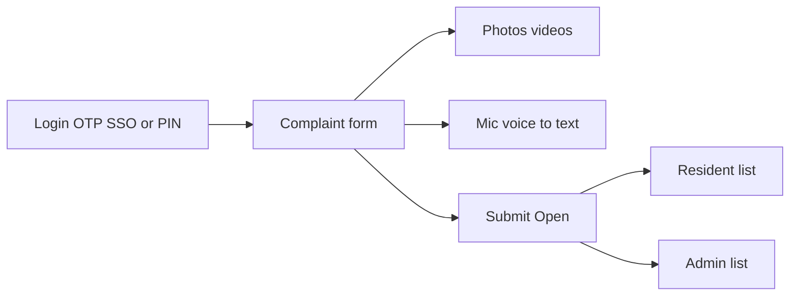

# Product Requirements Document (PRD)

**Document:** 02-PRD  
**Product:** SocietyHub  
**Version:** 1.4  
**Related:** [Vision](00-Vision.md), [BRD](01-BRD.md), [Architecture](03-Architecture.md)

## 1. Document control

| Field | Value |
|-------|--------|
| Status | Phase 1 = working Complaints; other planned features = Coming soon in UI |
| Version | 1.4 |
| MVP clients | **Two** simple responsive React apps: **client-app** (residents) + **manage** (Admin / Super Admin); phone + desktop browsers |
| Pilot | Keshav Heights Society |
| Source inputs | PSD, Vision, BRD, stakeholder MVP refinement |

## 2. Product overview

SocietyHub is a multi-tenant SaaS for housing societies. The **product roadmap includes all planned modules** (complaints, billing, payments, notices, notifications, dashboards, etc.).  

**Phase 1 ships working Complaints** (plus auth and onboard). Other planned modules appear in the simple responsive UIs as **Coming soon** placeholders—so residents and admins see the full product direction without implementing those backends yet.

**Clients (Fassport-style split):**

| App | Audience | Modes |
|-----|----------|--------|
| `apps/client-app` (`app.localhost:5173`) | Society members | **Admin \| Resident** toggle (like Fassport Raise \| Invest). Staff: Chairperson, Secretary, Treasurer, Cashier, Committee. Residents/tenants: Resident mode only. |
| `apps/manage` (`manage.localhost:5174`) | SocietyHub **platform employees** only | Create societies, add people to a society team. Day-to-day society admin is **not** here — add yourself to the society team and use Client App Admin. |

Both share one API (`apps/api`) and `packages/sdk`.

## 3. Goals and success metrics

### Phase 1 success (complaints first)

| Metric | Target |
|--------|--------|
| Residents can log in and raise a complaint in under a few minutes | Yes |
| Flat number auto-filled from profile | Yes |
| Admin can see all raised complaints and statuses | Yes |
| Photos/videos attach successfully | Yes |
| Voice-to-text usable on supported mobile browsers | Yes (graceful fallback if unsupported) |
| Nav shows other planned features as Coming soon | Yes (not functional) |

Long-term platform metrics (payments, SLA %, etc.) remain in [BRD](01-BRD.md) for Phase 2+.

## 4. Personas and roles (MVP)

| Role | Description |
|------|-------------|
| Society Admin (Admin) | Onboards society structure/residents; views all complaints; updates status |
| Resident | Linked to a flat; raises and tracks own complaints |
| Super Admin | Optional platform operator to create the society (pilot may seed one society) |

Secretary / Treasurer / Committee / Tenant refinements and full RBAC matrix apply in **Phase 2**; for MVP, **Admin** and **Resident** are sufficient.

### 4.1 Permissions matrix (MVP)

| Capability | Admin | Resident |
|------------|:-----:|:--------:|
| Onboard flats / residents | ✓ | |
| Login / logout | ✓ | ✓ |
| Raise complaint | ✓ (optional) | ✓ |
| View own complaints + status | ✓ | ✓ |
| View all society complaints + status | ✓ | |
| Update complaint status | ✓ | |

## 5. Product principles

1. **Simple UI/UX** — non-technical residents and admins; few screens; large tap targets; plain language; no clutter.
2. **Responsive web only (MVP)** — two React web apps (`apps/client-app` + `apps/manage`) that work on phone browsers and desktop; **no native app** for MVP.
3. Secure; complaint raise must feel as easy as messaging.
4. See also [Vision](00-Vision.md).

### 5.1 UI/UX rules (Phase 1)

| Do | Don't |
|----|--------|
| One primary action per screen (e.g. “Submit complaint”) | Fake working flows for Coming soon modules |
| Short forms: title, type, description, media | Multi-step wizards unless necessary |
| Auto-fill flat; hide complexity | Ask users for IDs they don’t know |
| Clear status labels (Open / In progress / Resolved / Closed) | Dense tables on mobile |
| Bottom nav or simple header on phone | Complex sidebars on small screens |
| Show planned modules with a clear **Coming soon** label | Hide the roadmap entirely or pretend features work |
| Readable contrast, simple Tailwind styling | Decorative cards, gradients, badge clutter |

**Clients:** two responsive **web applications** (React + Vite + Tailwind): resident portal and manage portal. Test at ~375px width and desktop.

### 5.2 Information architecture — Complaints live, rest Coming soon

Navigation (simple list or bottom/side nav) includes **all planned product areas**, but only Complaints (and account/auth) are interactive in Phase 1.

| Nav item | Phase 1 behavior |
|----------|------------------|
| Home / Complaints | **Live** — residents raise/track in `apps/client-app`; admins list all + status in `apps/manage` |
| Bills / Maintenance | **Coming soon** — placeholder screen, no API |
| Payments | **Coming soon** |
| Notices | **Coming soon** |
| Notifications | **Coming soon** (optional entry) |
| Dashboard / Reports | **Coming soon** |
| Residents / Directory | **Live in Manage** — Admin onboard only; richer directory Coming soon if not needed |
| Settings / Profile | Minimal live (logout, PIN); extras Coming soon |

**Coming soon screen:** short title, one-line “This feature is coming soon”, optional back to Complaints. No forms that submit. No dead ends without a way back.

Do **not** invent nav items outside the planned roadmap (PRD Phase 2 / Future).

## 6. Scope

### 6.1 Phase 1 in scope (working product)

1. **Onboard Admin** (create/configure admin for the society).
2. **Onboard Resident** (link resident to flat + mobile/SSO identity).
3. **Login / logout** via SSO (Google), mobile OTP, or PIN (after verified identity).
4. **Raise complaint** — title; flat auto-populated; description; type (Electric, Plumbing, …, Other); voice-to-text mic; photos and videos.
5. **Resident** — list own complaints + status; **Admin** — list all + update status (`Open` → `In Progress` → `Resolved` → `Closed`).
6. **App shell** — simple responsive nav that lists **all planned features**; non-live items open a **Coming soon** page (§5.2, §6.1a).

Minimal society/flat data required so flat can auto-populate.

### 6.1a Coming soon (visible, not implemented)

Show in UI only (placeholder pages). Backends and FR-* for these remain **Phase 2** (or Future) as specified below—do not build APIs yet:

- Bills / maintenance billing  
- Payments  
- Notices  
- Notifications center  
- Dashboards / reports  
- Advanced complaint SLA/assignment/comments (beyond basic status)  
- Full role matrix UI beyond Admin / Resident  

### 6.2 Phase 2 (implement for real — replace Coming soon)

Phase 2 builds on the complaint portal. It is **in product roadmap**, not dropped.

| Area | Phase 2 includes |
|------|------------------|
| **Roles** | Super Admin, Society Admin, Secretary, Treasurer, Committee, Resident, Tenant — full permissions matrix |
| **Society** | Full buildings → wings → flats CRUD; society settings (SLA days, billing defaults); committee role assignment |
| **Residents** | Owners vs tenants; move-in/move-out; profile self-update; tenant verification document store/retrieve |
| **Complaints (advanced)** | Status `Assigned`; assignment to staff; comments thread; SLA timers/reminders/escalation (BullMQ) |
| **Billing** | Generate maintenance bills per flat/period; line items; dues; defaulters; bill correct/void with audit |
| **Payments** | Razorpay online (UPI/card/netbanking); webhook reconciliation; cash/cheque/NEFT manual entry; receipts; payment history |
| **Notices** | Publish to all/wing/flat; read acknowledgment; edit/unpublish |
| **Notifications** | In-app inbox; email (Resend); web push (FCM); deep links |
| **Dashboards** | Secretary ops; Treasurer finance (collection %, outstanding); Committee read-only; richer resident home |
| **Audit** | Audit log UI for bill/complaint/payment/role mutations |

### 6.3 Future (after Phase 2)

Visitor, parking, clubhouse, staff attendance, CCTV requests, assets, full vendor module, events, marketplace, AI assistant, builder edition, municipal extensions, **iOS App Store listing** (same Flutter app as Android), WhatsApp notification channel.

**Native Android (now):** Flutter Client App in [`apps/mobile/`](../../apps/mobile/) — Play Store; mirrors `apps/client-app` (no bulk CSV, no manage portal).

## 7. Functional requirements

### 7.1 Authentication (MVP)

- FR-AUTH-1: Login with **mobile OTP** (MSG91); rate-limited; invalid/expired rejected.
- FR-AUTH-2: Login with **Google SSO**; bind to onboarded resident/admin when applicable.
- FR-AUTH-3: User can **set a PIN** after successful OTP or SSO; later sessions may unlock with PIN per Architecture (hashed at rest; never stored plaintext).
- FR-AUTH-4: **Logout** clears session.
- FR-AUTH-5: Admin can **onboard** residents (and admin users) with mobile and flat binding before first login.

### 7.2 Society & resident onboarding (MVP)

- FR-ONB-1: Admin onboarding for the pilot society (or Super Admin creates society + first Admin).
- FR-ONB-2: Admin registers residents against **flats** (flat number required for auto-fill).
- FR-ONB-3: Buildings/wings only as needed to uniquely identify flats for the pilot.

### 7.3 Complaint management (MVP)

- FR-CMP-1: Resident creates complaint with **title**, **type**, **description** → ticket number, status `Open`; **flat_id** taken from logged-in resident (not free-typed).
- FR-CMP-2: **Types** include at least: `electric`, `plumbing`, plus other predefined society types, and `other` (optional free-text subtype when Other).
- FR-CMP-3: **Voice-to-text**: UI mic control uses browser speech recognition (e.g. Web Speech API) to fill description; if unsupported, mic disabled with short message; typing still works.
- FR-CMP-4: Attach **photos and videos** to Azure Blob; show on detail; enforce size/type limits (Architecture).
- FR-CMP-5: Resident **lists own complaints** with status.
- FR-CMP-6: Admin **lists all society complaints** with status; can change status along: `Open` → `In Progress` → `Resolved` → `Closed` (assignment/SLA optional in MVP).
- FR-CMP-7: Complaint detail shows title, type, flat, description, media, status, timestamps.

### 7.3a App shell — Coming soon (Phase 1)

- FR-SHELL-1: Primary nav includes Complaints (live) plus planned Phase 2 entries (Bills, Payments, Notices, Dashboard at minimum).
- FR-SHELL-2: Selecting a non-live item shows a **Coming soon** page (title + short message + way back); no API calls that mutate data.
- FR-SHELL-3: Coming soon labels are visible in the nav (e.g. badge or subtitle) so users do not expect a working feature.
- FR-SHELL-4: Do not invent modules outside PRD Phase 2 / Future lists.

### 7.4 Phase 2 — roles and permissions

| Capability | Super Admin | Society Admin | Secretary | Treasurer | Committee | Resident / Tenant |
|------------|:-----------:|:-------------:|:---------:|:---------:|:---------:|:-----------------:|
| Create society | ✓ | | | | | |
| Manage buildings/wings/flats | | ✓ | ✓ | | | |
| Society settings (SLA, billing defaults) | | ✓ | ✓ | ✓ (billing defaults) | | |
| Assign committee roles | | ✓ | ✓ | | | |
| Manage residents / tenants | | ✓ | ✓ | | | |
| Raise / view own complaints | | ✓ | ✓ | ✓ | ✓ | ✓ |
| Assign / transition all complaints | | ✓ | ✓ | | view | |
| Generate / edit bills | | ✓ | | ✓ | | |
| Pay own bills online | | | | | | ✓ |
| Record manual payments | | ✓ | | ✓ | | |
| Publish notices | | ✓ | ✓ | | | |
| View dashboards (ops) | ✓ | ✓ | ✓ | | ✓ (read) | home only |
| View dashboards (finance) | ✓ | ✓ | | ✓ | ✓ (read) | own dues |
| View audit logs | ✓ | ✓ | | | | |

### 7.5 Phase 2 — society & residents (extended)

- FR-SOC-1: Super Admin creates society (name, address, timezone); system assigns `tenant_id`.
- FR-SOC-2: Society Admin/Secretary CRUD buildings → wings → flats; unique flat identity within society.
- FR-SOC-3: Society settings store complaint SLA days and billing period defaults.
- FR-SOC-4: Assign/revoke Secretary, Treasurer, Committee, Society Admin roles.
- FR-RES-1: Register owners against flats; searchable directory.
- FR-RES-2: Onboard tenants to flats; move-in/move-out updates occupancy; owner remains on record.
- FR-RES-3: Resident updates profile (phone, emergency contact, vehicle); visible to Secretary; audited.
- FR-RES-4: Upload/retrieve tenant verification documents via Azure Blob for authorized roles.

### 7.6 Phase 2 — complaints (advanced)

- FR-CMP-P2-1: Full workflow `Open` → `Assigned` → `In Progress` → `Resolved` → `Closed`; assignee required from Assigned onward.
- FR-CMP-P2-2: Comments by participants with author and timestamp.
- FR-CMP-P2-3: SLA from society settings; BullMQ reminders; escalate to Society Admin on breach.
- FR-CMP-P2-4: Resident sees full status history (assignment, comments) without calling committee.

### 7.7 Phase 2 — maintenance billing

- FR-BIL-1: Treasurer generates bills per flat for a period with line items and due date.
- FR-BIL-2: One open bill per flat/period (or explicit regenerate/void rules).
- FR-BIL-3: Resident views current/past bills and statuses: Unpaid, Partial, Paid, Overdue.
- FR-BIL-4: Treasurer views outstanding dues and defaulters (filter by wing/flat).
- FR-BIL-5: Bill corrections/voids write audit logs.

### 7.8 Phase 2 — payments

- FR-PAY-1: Resident pays bill via Razorpay (UPI/card/netbanking); success updates bill; failure leaves unpaid.
- FR-PAY-2: Razorpay webhooks verified and idempotent; payment linked to bill.
- FR-PAY-3: Treasurer records cash/cheque/NEFT with reference; updates bill; receipt available.
- FR-PAY-4: Resident downloads receipt (society, flat, amount, mode, date, transaction id).
- FR-PAY-5: Resident views payment history.

### 7.9 Phase 2 — notices

- FR-NOT-1: Secretary publishes notice to all residents or wing/flat subset.
- FR-NOT-2: Opening a notice records read; publisher sees read vs unread counts.
- FR-NOT-3: Edit/unpublish; unpublished hidden from residents; audited.

### 7.10 Phase 2 — notifications

- FR-NTF-1: In-app notifications for complaint changes, new bills, new notices; mark read; deep-link.
- FR-NTF-2: Email (Resend) for those critical events.
- FR-NTF-3: Web push via FCM after opt-in; graceful if permission denied.
- FR-NTF-4: WhatsApp channel remains **Future** (after Phase 2), not Phase 2 itself.

### 7.11 Phase 2 — dashboards

- FR-DSH-1: Secretary ops dashboard: open complaints, SLA breaches, recent notices.
- FR-DSH-2: Treasurer finance dashboard: collection %, outstanding dues, period payments.
- FR-DSH-3: Committee read-only ops + finance summaries.
- FR-DSH-4: Resident home: my dues, open complaints, latest notices.

### 7.12 Phase 2 — audit

- FR-AUD-1: Audit log entries for bill changes, complaint status/delete, payment recording, role changes—with actor, entity, action, timestamp; filterable by Society Admin.

## 8. Key end-to-end flows

### 8.1 Onboard and login (MVP)

Admin created → Admin onboards flats + residents → Resident logs in (OTP **or** Google SSO) → optionally **sets PIN** → later login with OTP/SSO/PIN → logout.

### 8.2 Raise and track complaint (MVP)

```text
Resident login
  → New complaint
  → Title + Type (Electric / Plumbing / … / Other)
  → Flat auto-filled
  → Description (type and/or mic voice-to-text)
  → Upload photos/videos
  → Submit → status Open
  → Resident sees list + status
  → Admin sees list + updates status
```



### 8.3 Phase 2 — complaint lifecycle (advanced)

```text
Open → Assigned → In Progress → Resolved → Closed
```

Notifications on assignment and status changes; SLA jobs monitor breach.

### 8.4 Phase 2 — monthly bill and pay

Treasurer generates period bills → residents notified → online Razorpay pay or Treasurer records offline → receipt → dashboards update collection %.

### 8.5 Phase 2 — notice publish and read

Secretary publishes → notifications → resident opens → `notice_reads` recorded → Secretary views read counts.

## 9. Non-functional requirements

### MVP

| Area | Requirement |
|------|-------------|
| Tenancy | Data scoped by `tenant_id` |
| Security | HTTPS; OTP rate limits; PIN hashed; RBAC Admin vs Resident |
| Responsiveness | Raise-complaint flow excellent on ~375px |
| Media | Photos + videos; max size/duration documented in Architecture |
| Speech | Best-effort on Chrome/Safari mobile; no blocker if unavailable |
| Availability | Pilot-ready on Azure |

### Phase 2 additions

| Area | Requirement |
|------|-------------|
| Security | Webhook signature verification (Razorpay); broader RBAC |
| Auditability | Soft delete + audit_logs for sensitive mutations |
| Performance | Paginated lists; society dashboards remain interactive at pilot scale |
| Jobs | BullMQ for SLA, email, push — never block HTTP on side effects |

## 10. Assumptions and dependencies

### MVP

- MSG91 (OTP), Google OAuth (SSO), Azure Blob (media)
- Browser Web Speech API for voice-to-text (no mandatory third-party STT in MVP)

### Phase 2

- Razorpay merchant account
- Resend for email
- Firebase project for web push
- Redis + BullMQ for SLA and notification workers

## 11. Traceability

- GitHub Issues for Phase 1 map to FR-AUTH-*, FR-ONB-*, FR-CMP-1…7, FR-SHELL-* (`label:scope:mvp`).
- **Phase 2** Issues map to FR-SOC-*, FR-RES-*, FR-CMP-P2-*, FR-BIL-*, FR-PAY-*, FR-NOT-*, FR-NTF-*, FR-DSH-*, FR-AUD-* (`label:scope:future` until Phase 2 starts; then promote to active release labels).
