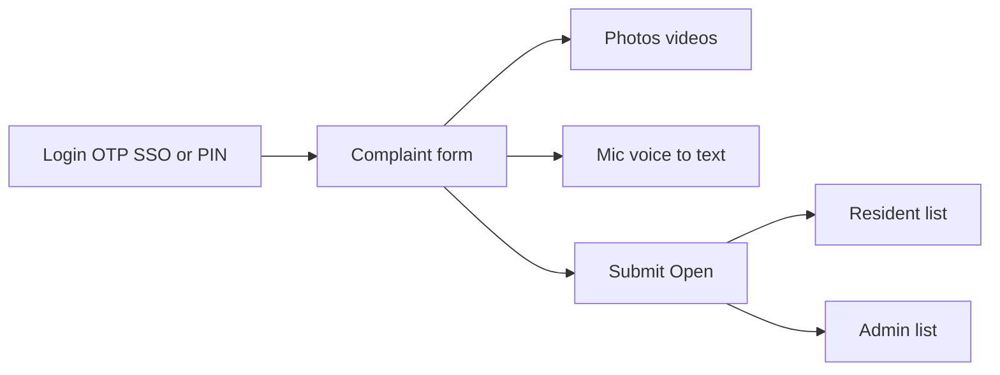

# Product Requirements Document (PRD)

**Document:** 02-PRD  
**Product:** SocietyHub  
**Version:** 1.4  
**Related:** [Vision](00-Vision.md), [BRD](01-BRD.md), [Architecture](03-Architecture.md)

## 1. Document control

| Field | Value |
|-------|--------|
| Status | Phase 2 demo program — Client App modules live; Manage commercial in progress |
| Version | 1.5 |
| MVP clients | **Two** simple responsive React apps: **client-app** (residents) + **manage** (Admin / Super Admin); phone + desktop browsers |
| Pilot | Keshav Heights Society |
| Source inputs | PSD, Vision, BRD, stakeholder MVP refinement |

## 2. Product overview

SocietyHub is a multi-tenant SaaS for housing societies. The **product roadmap includes all planned modules** (complaints, billing, payments, notices, notifications, dashboards, etc.).  

**Phase 1** shipped Complaints + Society & Resident Management. **Phase 2 demo** completes Client App Bills, Payments, Notices, Notifications, Dashboard, Audit, and society ops (Visitors, Parking, Bookings, Assets, Vendors, Events), plus Manage commercial controls (plans, flags, platform invoices, branding/domain, platform-fee Razorpay/offline). WhatsApp inbound, marketplace, and **resident** Razorpay checkout remain Future.

**Clients (Fassport-style split):**

| App | Audience | Modes |
|-----|----------|--------|
| `apps/client-app` (`{slug}.…` or society custom domain) | Society members | **Admin \| Resident** toggle (like Fassport Raise \| Invest). Wears that society’s logo + brand color when branding is enabled. Staff: Chairperson, Secretary, Treasurer, Cashier, Committee. Residents/tenants: Resident mode only. |
| `apps/manage` (`manage.…`) | SocietyHub **platform employees**, plus **public society self-onboarding** at `/onboard` | Fassport-style shell: society picker, **Open Client App**, **Viewing as Admin \| Tenant**. Admin = platform console. Tenant = selected society workspace. A new society can register, pick a plan, pay the platform fee, then use the Client App as chairperson. |

Both share one API (`apps/api`) and `packages/sdk`. Manage login never switches JWT on picker change. Host → society resolution sets `x-society` (custom domain, then `{slug}.{SOCIETYHUB_ROOT_DOMAIN}`; never `manage` / `api` / `app` / `www`).

## 3. Goals and success metrics

### Phase 1 success (complaints first)

| Metric | Target |
|--------|--------|
| Residents can log in and raise a complaint in under a few minutes | Yes |
| Flat number auto-filled from profile | Yes |
| Admin can see all raised complaints and statuses | Yes |
| Photos/videos attach successfully | Yes |
| Voice-to-text usable on supported mobile browsers | Yes (graceful fallback if unsupported) |
| Nav shows other planned features as Coming soon | Yes (not functional) |

Long-term platform metrics (payments, SLA %, etc.) remain in [BRD](01-BRD.md) for Phase 2+.

## 4. Personas and roles (MVP)

| Role | Description |
|------|-------------|
| Society Admin (Admin) | Onboards society structure/residents; views all complaints; updates status |
| Resident | Linked to a flat; raises complaints for the flat; tracks flat complaints |
| Super Admin | Optional platform operator to create the society (pilot may seed one society) |

Secretary / Treasurer / Committee / Tenant refinements and full RBAC matrix apply in **Phase 2**; for MVP, **Admin** and **Resident** are sufficient.

### 4.1 Permissions matrix (MVP)

| Capability | Admin | Resident |
|------------|:-----:|:--------:|
| Onboard flats / residents | ✓ | |
| Login / logout | ✓ | ✓ |
| Raise complaint | ✓ (optional) | ✓ |
| Update Account household details (linked flat) | ✓ | ✓ |
| View flat complaints + status | ✓ | ✓ |
| View all society complaints + status | ✓ | |
| Update complaint status | ✓ | |

## 5. Product principles

1. **Simple UI/UX** — non-technical residents and admins; few screens; large tap targets; plain language; no clutter.
2. **Responsive web only (MVP)** — two React web apps (`apps/client-app` + `apps/manage`) that work on phone browsers and desktop; **no native app** for MVP.
3. Secure; complaint raise must feel as easy as messaging.
4. See also [Vision](00-Vision.md).

### 5.1 UI/UX rules (Phase 1)

| Do | Don't |
|----|--------|
| One primary action per screen (e.g. “Submit complaint”) | Fake working flows for Coming soon modules |
| Short forms: title, type, description, media | Multi-step wizards unless necessary |
| Auto-fill flat; hide complexity | Ask users for IDs they don’t know |
| Clear status labels (Open / In progress / Resolved / Closed) | Dense tables on mobile |
| Bottom nav or simple header on phone | Complex sidebars on small screens |
| Show planned modules with a clear **Coming soon** label | Hide the roadmap entirely or pretend features work |
| Readable contrast, simple Tailwind styling | Decorative cards, gradients, badge clutter |

**Clients:** two responsive **web applications** (React + Vite + Tailwind): resident portal and manage portal. Test at ~375px width and desktop.

### 5.2 Information architecture — Complaints live, rest Coming soon

Navigation (simple list or bottom/side nav) includes **all planned product areas**, but only Complaints (and account/auth) are interactive in Phase 1.

| Nav item | Phase 1 behavior |
|----------|------------------|
| Home / Complaints | **Live** — residents raise/track in `apps/client-app`; admins list all + status in `apps/manage` |
| Bills / Maintenance | **Early stub live** in Client App — generate, list, bill detail (owner/occupants, line items, payments), staff notify residents, offline UPI proof. Full FR-BIL-* (due dates, partial pay, defaulters) remains Phase 2 |
| Payments | **Early stub live** in Client App — publish UPI/QR, review screenshots, credit/reject, record cash/cheque/NEFT. Full FR-PAY-* (Razorpay online) remains Phase 2 |
| Notices | **Early stub live** — draft/publish, photos & videos, WhatsApp share link. Full FR-NOT-* (read receipts) remains Phase 2 |
| Notifications | **Coming soon** (optional entry) |
| Dashboard / Reports | **Coming soon** |
| Residents | **Live** in Client App Admin and Flutter Admin — **one blade**: **Flats** (all units / occupancy) and **People** (directory of app users + pending invitations); **Add resident** opens the household form. Manage does not host day-to-day resident add |
| Settings / Profile | Minimal live (logout, PIN); extras Coming soon |

**Coming soon screen:** short title, one-line “This feature is coming soon”, optional back to Complaints. No forms that submit. No dead ends without a way back.

Do **not** invent nav items outside the planned roadmap (PRD Phase 2 / Future).

## 6. Scope

### 6.1 Phase 1 in scope (working product)

1. **Onboard Admin** (create/configure admin for the society).
2. **Onboard Resident** (link resident to flat + mobile/SSO identity).
3. **Login / logout** via SSO (Google), mobile OTP, or PIN (after verified identity).
4. **Raise complaint** — title; flat auto-populated; description; type (Electric, Plumbing, …, Other); voice-to-text mic; photos and videos.
5. **Resident** — list **flat** complaints + status; **Admin** — list all + update status (`Open` → `In Progress` → `Resolved` → `Closed`).
6. **App shell** — simple responsive nav that lists **all planned features**; non-live items open a **Coming soon** page (§5.2, §6.1a).

Minimal society/flat data required so flat can auto-populate.

### 6.1a Coming soon (visible, not implemented)

Show in UI only (placeholder pages). Backends and FR-* for these remain **Phase 2** (or Future) as specified below—do not build APIs yet:

- Bills / maintenance billing  
- Payments  
- Notices  
- Notifications center  
- Dashboards / reports  
- Advanced complaint SLA/assignment/comments (beyond basic status)  
- Full role matrix UI beyond Admin / Resident  

### 6.2 Phase 2 (implement for real — replace Coming soon)

Phase 2 builds on the complaint portal. It is **in product roadmap**, not dropped.

| Area | Phase 2 includes |
|------|------------------|
| **Roles** | Super Admin, Society Admin, Secretary, Treasurer, Committee, Resident, Tenant — full permissions matrix |
| **Society** | Full buildings → wings → flats CRUD; society settings (SLA days, billing defaults); committee role assignment |
| **Residents** | Owners vs tenants; move-in/move-out; profile self-update; tenant verification document store/retrieve |
| **Complaints (advanced)** | Status `Assigned`; assignment to staff; comments thread; SLA timers/reminders/escalation (BullMQ) |
| **Billing** | Generate maintenance bills per flat/period; line items; dues; defaulters; bill correct/void with audit |
| **Payments (resident maintenance)** | **Now:** offline UPI/QR — society posts UPI ID + optional QR/account details; resident uploads a payment screenshot; Admin/Treasurer reviews, credits the bill, and acknowledges (or rejects). Cash/cheque/NEFT staff entry still available. **Future:** same Razorpay gateway for resident online pay. |
| **Payments (platform fee)** | **Now:** society **self-onboarding** on Manage `/onboard` (plan + coupon + Pay offline / Razorpay). Platform invoices also payable in Tenant view. Signed webhooks provision the society only after capture. Resident maintenance pay stays offline UPI. |
| **Notices** | Publish to all/wing/flat; read acknowledgment; edit/unpublish |
| **Notifications** | In-app inbox; email (Resend); web push (FCM); deep links |
| **Dashboards** | Secretary ops; Treasurer finance (collection %, outstanding); Committee read-only; richer resident home |
| **Audit** | Audit log UI for bill/complaint/payment/role mutations |

### 6.2a Phase 2 society ops (demo — Client App)

| Area | Behavior |
|------|----------|
| **Visitors** | Resident pre-registers; **issue digital pass** (QR + OTP) shared to visitor phone via SMS + WhatsApp; staff Gate verifies QR or OTP; expiry enforced; check-in/out; expected vs on-site vs history |
| **Parking** | Assign/release Manage inventory lots to flats; residents see own lots/vehicles |
| **Bookings** | Request facility + time; conflict detection; staff confirm/cancel |
| **Assets** | Staff register/edit assets (location, optional next-service date) |
| **Vendors** | Staff directory (category, phone, notes) |
| **Events** | Staff publish; residents RSVP with optional capacity |

### 6.2b Phase 2 Manage commercial (demo)

Plans (Starter/Growth/Enterprise), per-society subscription + feature flags, discounts, platform subscription invoices (offline + Razorpay when purchased), payment timeline/reconcile, society branding (logo + brand color) and domain (slug + custom domain), platform announcements, support tickets, integrations **health** (read-only — secrets stay in env). Manage **Users** lists platform employees (`superadmin`) only.

### 6.3 Future (after Phase 2)

Staff attendance, CCTV requests, advanced vendor procurement, marketplace, AI assistant, builder edition, municipal extensions, **iOS App Store listing**, WhatsApp inbound complaint channel, **resident** Razorpay live checkout (reuses the platform payment gateway).

**Native Android (now):** Flutter Client App in [`apps/mobile/`](../../apps/mobile/) — Play Store; mirrors `apps/client-app` (no bulk CSV, no manage portal).

## 7. Functional requirements

### 7.1 Authentication (MVP)

- FR-AUTH-1: Login with **mobile OTP** (MSG91); rate-limited; invalid/expired rejected.
- FR-AUTH-2: Login with **Google SSO**; bind to onboarded resident/admin when applicable.
- FR-AUTH-3: User can **set a PIN** after successful OTP or SSO; later sessions may unlock with PIN per Architecture (hashed at rest; never stored plaintext).
- FR-AUTH-4: **Logout** clears session.
- FR-AUTH-5: Admin can **onboard** residents (and admin users) with mobile and flat binding before first login.
- FR-AUTH-6: Android **welcome** screen shows the **installed version**. If Play has a newer build, show an **Update** button that opens the in-app update or Play listing.
- FR-AUTH-7: **Choose society** lists **one option per society**. Extra staff roles in the same society (Chairperson + Committee) are not separate choices — switch **Admin | Resident** in Client App after entering.
- FR-AUTH-8: Android auth is **Welcome → Login → method launchers (OTP / Google / PIN / Email) → form**. System and AppBar back walk that stack. After login, AppBar / system back pops pushed detail screens (e.g. complaint detail) or returns to Dashboard from drawer destinations.

### 7.2 Society & resident onboarding (MVP)

- FR-ONB-1: Admin onboarding for the pilot society (or Super Admin creates society + first Admin).
- FR-ONB-2: Admin registers residents against **flats**. The form is **flat first**: pick wing/flat on the same screen as the tabs — **Owner**, **Family**, **Parking Details**, **Two-wheelers**, **Four-wheelers**, and **Gas**. The owner tab captures name, contact number, email, and emergency contact, and can **edit the existing owner**. **Parking Details** assigns a Manage parking lot (puzzle or open). The number list shows free lots of the selected type plus lots already on this flat; lots on other flats stay visible but cannot be stolen. Family tab lists family members in a table (add / edit dialog, delete). Household age counts stay on that tab. Staff can remove a family member; the owner cannot be removed there. **A flat has exactly one owner.** Everyone else on that flat is a family member. Each person is a separate resident with their own mobile (OTP). Email is optional and must be unique if provided. Parking included slots (FR-ONB-7) apply to the **flat**, not per person. Adding another person as owner (without `editOwner`) is stored as family.
- FR-ONB-2b: After the owner is onboarded, that **owner resident** can add family members to their own flat (name, contact number, optional email). Each family member can log in with their own mobile OTP and raise complaints for that flat. Only the owner can add household members; society staff can still add people from **Add resident** on Residents.
- FR-ONB-3: **SocietyHub platform employees** define society structure only from **Manage**, in hierarchy order: **Society** → **Towers (buildings)** → **Wings** → **Flats** (and parking separately). New societies start with **no** towers/wings/flats — the operator adds them on society detail under **Structure**, then **Flats**. Platform can **rename** the society, and **add / rename / delete** towers and wings. Delete of a tower or wing is blocked while any linked flat still has residents (or any live flat under that node — remove flats first). Flat add/CSV requires a selected tower; CSV columns stay `wing,floor,flatNumber` (no tower column). Wings under that tower are created as needed when adding flats, or managed explicitly on Structure. Flats list is paginated. Client App Admin **lists** flats (Occupancy + Layout) for onboard and does **not** create or bulk-import flats.
- FR-ONB-3b: **SocietyHub platform employees** add, edit, and remove **parking slots** only from Manage society detail. Two kinds: **puzzle** (wing + parking number; typical wings A–D) and **open** (parking number only). Puzzle parking number is the slot only (101, not A-101); the same number may exist in another wing. Floor is not collected for parking. Open parking numbers are unique in the society. Remove is blocked while a flat still uses that slot. Client App Admin **picks** a slot when onboarding; they do not invent parking numbers or run parking CSV.
- FR-ONB-3c: Client App Admin uses **one Residents blade** with two views: **Flats** (occupancy + read-only layout) and **People** (directory of members who can sign in, plus pending invitations). Structure inventory (towers / flats / parking create) lives only in Manage.
- FR-ONB-4: Society Admin can add, update (name / email / mobile / role), and remove society team members in Client App Admin. A team member cannot remove themselves. From **Residents → People** (directory action) or **resident detail**, staff can **Assign team role** to an existing member (same person keeps flat membership + gains Admin-mode access).
- FR-ONB-5: Society Admin uses one **Residents** blade on Client App Admin and Flutter Admin: **Flats** (all units) and **People** (**Directory** of members who can access the app + **Pending invitations**). **Add resident** opens the household onboard form (Owner / Family / Parking / vehicles / Gas). Optional Email / WhatsApp checkboxes send a **welcome** (sign in with OTP) — they do **not** create an invitation token. Staff create path is onboard-now, not a separate Invite form. Bulk CSV stays web-only. Move-out / verification detail remain on resident detail (web).
- FR-ONB-6: Platform employees on Manage society detail can list that society's team, add members (email, mobile, role), and remove members. They cannot remove themselves. Contact/role edits stay in Client App Admin.
- FR-ONB-7: Each flat includes **2 two-wheeler** and **1 four-wheeler** parking by default. Admins can record more than one bike and more than one car; any vehicle beyond those included slots must be marked as **purchased parking** (optional slot label). **CSV import may skip registration numbers** and record only counts in `twoWheelers` / `fourWheelers` (for example `2` and `1`). Count-only extras beyond the included slots are stored as purchased parking.
- FR-ONB-8: Onboard records whether the flat has taken a **PNG gas connection** (yes / no).
- FR-ONB-9: Onboard records how many people live in the flat by age group: **Adult**, **Child**, and **Senior citizen**. These counts are per **flat** (shared by everyone onboarded to that flat). CSV columns: `adults`, `children`, `seniorCitizens`.
- FR-ONB-10: **Account** has three sections: **My flat**, **Household**, and **Security**. Household uses the same tabs as **Add resident**: **Owner**, **Family**, **Parking Details**, **Two-wheelers**, **Four-wheelers**, and **Gas**. Owner shows the flat owner’s name / mobile / email (read-only) plus emergency contact. Family holds the family table (add / edit / delete only for the owner) plus Adult / Child / Senior citizen counts. Parking Details assigns a Manage lot the same way staff Add resident does. Vehicles and PNG stay on their tabs. Household fields apply to the **flat**. Vehicle parking quota (FR-ONB-7) is enforced across the household. Security holds password and PIN.

### 7.3 Complaint management (MVP)

- FR-CMP-1: Resident creates complaint with **title**, **type**, **description** → ticket number, status `Open`; **flat_id** taken from logged-in resident (not free-typed).
- FR-CMP-2: **Types** include at least: `electric`, `plumbing`, plus other predefined society types, and `other` (optional free-text subtype when Other).
- FR-CMP-3: **Voice-to-text**: UI mic control uses browser speech recognition (e.g. Web Speech API) to fill description; if unsupported, mic disabled with short message; typing still works.
- FR-CMP-4: Attach **photos and videos** to Azure Blob; show on detail; enforce size/type limits (Architecture).
- FR-CMP-5: Resident **lists complaints for their linked flat(s)** with status (all household tickets on that flat, not only tickets they personally raised).
- FR-CMP-6: Admin **lists all society complaints** with status; can change status along: `Open` → `In Progress` → `Resolved` → `Closed` (assignment/SLA optional in MVP).
- FR-CMP-7: Complaint detail shows title, type, flat, description, media, status, timestamps in the **viewer's local timezone** (API stores UTC).
- FR-CMP-8: The raiser can **edit** title/type/description until the ticket is resolved or closed, and **delete** an `Open` ticket they raised. Staff can still soft-delete any ticket. Flat-mates may view and comment but cannot edit/delete someone else’s ticket.
- FR-CMP-9: Flat members and staff can **add comments**, **ask questions**, and see the thread plus status-update notes on tickets they can view.

### 7.3a App shell — Coming soon (Phase 1)

- FR-SHELL-1: Primary nav includes Complaints (live) plus planned Phase 2 entries (Bills, Payments, Notices, Dashboard at minimum).
- FR-SHELL-2: Selecting a non-live item shows a **Coming soon** page (title + short message + way back); no API calls that mutate data.
- FR-SHELL-3: Coming soon labels are visible in the nav (e.g. badge or subtitle) so users do not expect a working feature.
- FR-SHELL-4: Do not invent modules outside PRD Phase 2 / Future lists.

### 7.4 Phase 2 — roles and permissions

| Capability | Super Admin | Society Admin | Secretary | Treasurer | Committee | Resident / Tenant |
|------------|:-----------:|:-------------:|:---------:|:---------:|:---------:|:-----------------:|
| Create society | ✓ | | | | | |
| Manage buildings/wings/flats | | ✓ | ✓ | | | |
| Society settings (SLA, billing defaults) | | ✓ | ✓ | ✓ (billing defaults) | | |
| Assign committee roles | | ✓ | ✓ | | | |
| Manage residents / tenants | | ✓ | ✓ | | | |
| Raise / view flat complaints | | ✓ | ✓ | ✓ | ✓ | ✓ |
| Assign / transition all complaints | | ✓ | ✓ | | view | |
| Generate / edit bills | | ✓ | | ✓ | | |
| Pay own bills online | | | | | | ✓ |
| Record manual payments | | ✓ | | ✓ | | |
| Publish notices | | ✓ | ✓ | | | |
| View dashboards (ops) | ✓ | ✓ | ✓ | | ✓ (read) | home only |
| View dashboards (finance) | ✓ | ✓ | | ✓ | ✓ (read) | own dues |
| View audit logs | ✓ | ✓ | | | | |

### 7.5 Phase 2 — society & residents (extended)

- FR-SOC-1: Super Admin creates society (name, address, timezone); system assigns `tenant_id`.
- FR-SOC-2: Society Admin/Secretary CRUD buildings → wings → flats remains **Phase 2**. Until then, towers / flats / parking inventory are **Manage-only** (FR-ONB-3 / FR-ONB-3b).
- FR-SOC-3: Society settings store complaint SLA days and billing period defaults.
- FR-SOC-4: Assign/revoke Secretary, Treasurer, Committee, Society Admin roles.
- FR-RES-1: Register owners against flats; searchable directory.
- FR-RES-2: Onboard tenants to flats; move-in/move-out updates occupancy; owner remains on record.
- FR-RES-3: Resident updates profile (phone, emergency contact, vehicle); visible to Secretary; audited. **MVP Account** also covers FR-ONB-10 household fields (PNG, family counts, vehicles) for a linked flat.
- FR-RES-4: Upload/retrieve tenant verification documents via Azure Blob for authorized roles.

### 7.6 Phase 2 — complaints (advanced)

- FR-CMP-P2-1: Full workflow `Open` → `Assigned` → `In Progress` → `Resolved` → `Closed`; assignee required from Assigned onward.
- FR-CMP-P2-2: Comments by participants with author and timestamp.
- FR-CMP-P2-3: SLA from society settings; BullMQ reminders; escalate to Society Admin on breach.
- FR-CMP-P2-4: Resident sees full status history (assignment, comments) without calling committee.

### 7.7 Phase 2 — maintenance billing

- FR-BIL-1: Treasurer generates bills per flat for a period with line items and due date.
- FR-BIL-2: One open bill per flat/period (or explicit regenerate/void rules).
- FR-BIL-3: Resident views current/past bills and statuses: Unpaid, Partial, Paid, Overdue.
- FR-BIL-4: Treasurer views outstanding dues and defaulters (filter by wing/flat).
- FR-BIL-5: Bill corrections/voids write audit logs.

### 7.8 Payments (offline first; Razorpay later)

- FR-PAY-1: Society Admin/Treasurer publishes **offline pay details**: UPI ID, optional account name / number / IFSC, optional QR image. Residents see these when paying a bill.
- FR-PAY-2: Resident pays **outside the app** (UPI/QR/bank), then uploads a **screenshot** against an unpaid bill. Payment stays `pending` until staff review. Bill is not marked paid yet.
- FR-PAY-3: Admin/Treasurer reviews the screenshot, then **acknowledges** (credit: payment `success`, bill `paid`, receipt issued) or **rejects** (payment `failed`, bill stays unpaid; resident may submit again).
- FR-PAY-4: Treasurer may still record cash/cheque/NEFT in person (immediate credit).
- FR-PAY-5: Resident views payment history (pending / success / rejected) and receipt after acknowledgement.
- FR-PAY-6 **(future):** Resident pays bill via Razorpay (UPI/card/netbanking); verified webhooks; do not treat client-reported success as paid.

### 7.9 Notices (early stub + Phase 2)

- FR-NOT-0 (live stub): Staff create draft/publish notices; optional **image/video** attachments; staff and residents can **Share on WhatsApp** (pre-filled message + deep link). Not WhatsApp Business API delivery.
- FR-NOT-1: Secretary publishes notice to all residents or wing/flat subset.
- FR-NOT-2: Opening a notice records read; publisher sees read vs unread counts.
- FR-NOT-3: Edit/unpublish; unpublished hidden from residents; audited.

### 7.10 Phase 2 — notifications

- FR-NTF-1: In-app notifications for complaint changes, new bills, new notices; mark read; deep-link.
- FR-NTF-2: Email (Resend) for those critical events.
- FR-NTF-3: Web push via FCM after opt-in; graceful if permission denied.
- FR-NTF-4: Outbound transactional WhatsApp is live. Platform Admin chooses the provider in Manage → Integrations (`stub`, `twilio`, `gupshup`, or `meta`). Business routes call the communication ledger, not a vendor SDK. Delivery failure does not change payment or bill status. Inbound WhatsApp complaint bot remains future.

### 7.10a Phase 2 — visitors / gate pass

- FR-VIS-1: Resident (own flat) or staff pre-registers a visitor (name, phone, purpose, expected time).
- FR-VIS-2: Resident or staff **issues a digital pass**: opaque `pass_token`, 6-digit OTP (hashed at rest), `expires_at` default **4 hours** from `expected_at` or issue time (staff may set up to **24 hours**). Phone required to issue.
- FR-VIS-3: On issue/re-issue, SocietyHub sends the visitor **SMS + WhatsApp** with pass link/QR payload and OTP (SMS via MSG91; WhatsApp via the provider selected in Manage; stub when that provider is `stub`). Response returns QR payload + OTP **once** for in-app display/share. OTP is not written to logs or audit.
- FR-VIS-4: Staff **Gate** screen (Client App Admin + Flutter) previews a pass by token/QR, then **verifies** via QR signature and/or OTP. Success checks the visitor in, records verifier, audits `visitor.pass_verified` (no OTP in audit), notifies flat residents in-app.
- FR-VIS-5: Expired, revoked, or already-used passes are rejected. Staff may **revoke** an issued pass. Cross-tenant pass ids return **404**.
- FR-VIS-6: Walk-in: staff may create a visitor and issue a pass at the gate in the same session.

### 7.11 Phase 2 — dashboards

- FR-DSH-1: Secretary ops dashboard: open complaints, SLA breaches, recent notices.
- FR-DSH-2: Treasurer finance dashboard: collection %, outstanding dues, period payments.
- FR-DSH-3: Committee read-only ops + finance summaries.
- FR-DSH-4: Resident home: my dues, open complaints, latest notices.

### 7.12 Phase 2 — audit

- FR-AUD-1: Audit log entries for bill changes, complaint status/delete, payment recording, role changes—with actor, entity, action, timestamp; filterable by Society Admin.

## 8. Key end-to-end flows

### 8.1 Onboard and login (MVP)

Admin created → Admin onboards flats + residents → Resident logs in (OTP **or** Google SSO) → optionally **sets PIN** → later login with OTP/SSO/PIN → logout.

### 8.2 Raise and track complaint (MVP)

```text
Resident login
  → New complaint
  → Title + Type (Electric / Plumbing / … / Other)
  → Flat auto-filled
  → Description (type and/or mic voice-to-text)
  → Upload photos/videos
  → Submit → status Open
  → Resident sees list + status
  → Admin sees list + updates status
```


```mermaid
flowchart LR
  Login[Login OTP SSO or PIN] --> Form[Complaint form]
  Form --> Media[Photos videos]
  Form --> Voice[Mic voice to text]
  Form --> Submit[Submit Open]
  Submit --> ResList[Resident list]
  Submit --> AdmList[Admin list]
```

### 8.3 Phase 2 — complaint lifecycle (advanced)

```text
Open → Assigned → In Progress → Resolved → Closed
```

Notifications on assignment and status changes; SLA jobs monitor breach.

### 8.4 Phase 2 — monthly bill and pay

Treasurer generates period bills → resident pays via society UPI/QR and uploads screenshot → Admin/Treasurer reviews and credits → receipt. Razorpay checkout is future.

### 8.5 Phase 2 — notice publish and read

Secretary publishes → notifications → resident opens → `notice_reads` recorded → Secretary views read counts.

## 9. Non-functional requirements

### MVP

| Area | Requirement |
|------|-------------|
| Tenancy | Data scoped by `tenant_id` |
| Security | HTTPS; OTP rate limits; PIN hashed; RBAC Admin vs Resident |
| Responsiveness | Raise-complaint flow excellent on ~375px |
| Media | Photos + videos; max size/duration documented in Architecture |
| Speech | Best-effort on Chrome/Safari mobile; no blocker if unavailable |
| Availability | Pilot-ready on Azure |

### Phase 2 additions

| Area | Requirement |
|------|-------------|
| Security | Webhook signature verification (Razorpay); broader RBAC |
| Auditability | Soft delete + audit_logs for sensitive mutations |
| Performance | Paginated lists; society dashboards remain interactive at pilot scale |
| Jobs | BullMQ for SLA, email, push — never block HTTP on side effects |

## 10. Assumptions and dependencies

### MVP

- MSG91 (OTP), Google OAuth (SSO), Azure Blob (media)
- Browser Web Speech API for voice-to-text (no mandatory third-party STT in MVP)

### Phase 2

- Razorpay merchant account
- Resend for email
- Firebase project for web push
- Redis + BullMQ for SLA and notification workers

## 11. Traceability

- GitHub Issues for Phase 1 map to FR-AUTH-*, FR-ONB-*, FR-CMP-1…7, FR-SHELL-* (`label:scope:mvp`).
- **Phase 2** Issues map to FR-SOC-*, FR-RES-*, FR-CMP-P2-*, FR-BIL-*, FR-PAY-*, FR-NOT-*, FR-NTF-*, FR-DSH-*, FR-AUD-* (`label:scope:future` until Phase 2 starts; then promote to active release labels).
