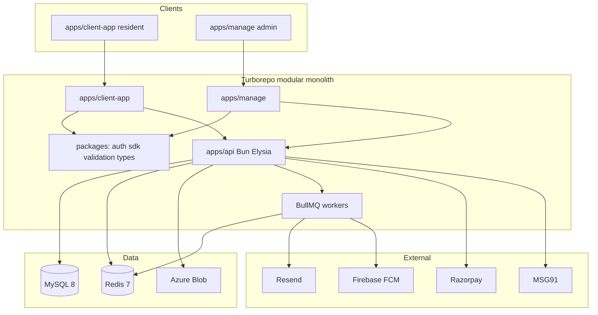
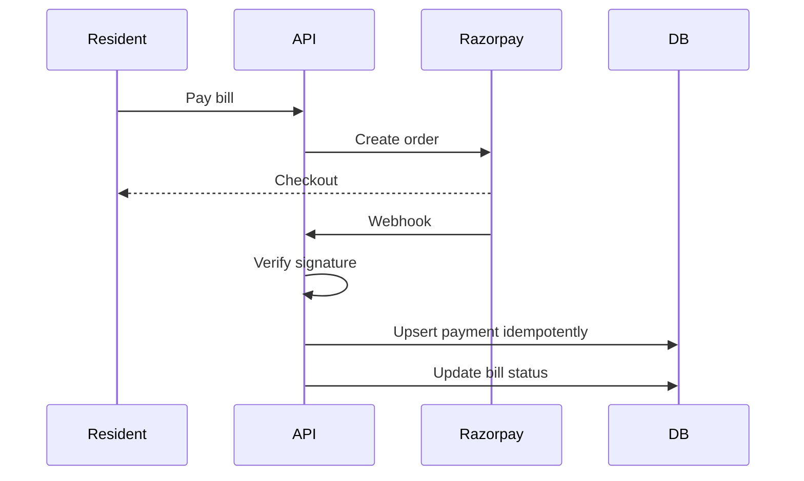
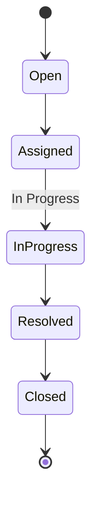

# Architecture

**Document:** 03-Architecture  
**Product:** SocietyHub  
**Version:** 1.0  
**Related:** [PRD](02-PRD.md), [Database](04-Database.md), [Tech Stack](07-Tech-Stack.md), [Coding Standards](06-Coding-Standards.md)

## 1. Goals and style

SocietyHub is implemented as a **modular monolith**: one deployable API with clear feature modules, shared packages, and strict tenant isolation. This optimizes MVP speed and operational simplicity while allowing future extraction of modules if needed.

**MVP clients:** two **simple, responsive React web apps** — `apps/client-app` (residents) and `apps/manage` (Admin / Super Admin). Flutter is out of MVP. UI/UX stays minimal per PRD §5 — not a dense dashboard product in Phase 1.

**MVP product slice:** complaint portal (auth + onboard + raise/track complaints). Billing/payments/notices are Phase 2 — still designed for, not required to implement for MVP.

## 2. Locked technical stack

Canonical explanation: **[07-Tech-Stack.md](07-Tech-Stack.md)**. Summary:

| Layer | Choice |
|-------|--------|
| Monorepo | Turborepo + Bun workspaces |
| API | Bun + TypeScript (strict) + Elysia + Zod |
| ORM / DB | Drizzle + MySQL 8 |
| Jobs / cache | Redis 7 + BullMQ (Phase 2) |
| Files | Azure Blob |
| Web | React + TypeScript + Vite + Tailwind (+ headless/Radix) |
| Auth | OTP (MSG91) + Google SSO + PIN |
| Email | Resend (Phase 2) |
| Push | Firebase Cloud Messaging web (Phase 2) |
| Payments | Razorpay + manual (Phase 2) |
| Hosting | Azure Container Apps, Static Web Apps, Azure Database for MySQL |
| Tests | Vitest + Playwright (when implementing) |

## 3. System context



## 4. Target monorepo layout (documentation only)

```text
society-hub/
  apps/
    api/                 # Bun + Elysia modular monolith (Phase 1)
    client-app/          # Resident React + Vite UI (Phase 1)
    manage/              # Admin / Super Admin React + Vite UI (Phase 1)
    mobile/              # Future native — placeholders only
      android/           # Android target placeholder
      ios/               # iOS target placeholder
  packages/
    auth/
    sdk/
    validation/
    types/
  devops/                # Azure staging/production, Docker
  docs/
  AGENTS.md
  .cursor/skills/
```

Phase 1 implements **client-app + manage + api**. `apps/mobile/**` stays empty of app code until Flutter Future scope starts; see [apps/mobile/README.md](../../apps/mobile/README.md).

Backend feature modules (illustrative):

```text
apps/api/src/modules/{auth,society,resident,complaints,billing,payments,notice}/
  routes.ts | service.ts | repository.ts | schema.ts | dto.ts
```

Cross-cutting: notifications, audit, tenancy middleware.

## 5. Backend modules

| Module | Responsibility |
|--------|----------------|
| auth | OTP, Google OAuth, sessions, invites |
| society | Society, buildings, wings, flats, settings, roles |
| resident | Owners, tenants, profiles, document metadata |
| complaints | Tickets, comments, attachments, SLA hooks |
| billing | Bill generation, line items, dues |
| payments | Razorpay, webhooks, manual payments, receipts |
| notice | Publish, targeting, read tracking |
| notifications | In-app rows + enqueue email/push |
| audit | Write/query audit_logs |

## 6. Multi-tenancy

- Every business table includes `tenant_id` (see [Database](04-Database.md)).
- After authentication, society context resolves `tenant_id` server-side.
- Repositories **must** filter by `tenant_id`. Never trust a client-supplied tenant id alone.
- Cross-tenant access returns 403/404.

## 7. Authentication and authorization

- **OTP:** MSG91 send/verify; store challenges in `otp_challenges`; rate limit.
- **Google SSO:** OAuth code flow; link to onboarded admin/resident.
- **PIN:** After OTP or SSO success, user may set a numeric PIN. Store only a **one-way hash** (e.g. Argon2/bcrypt) on `users` (or `user_credentials`). PIN unlock establishes a session equivalent to login for that user on that client; require re-OTP/SSO if PIN reset or lockout after N failures.
- **Session:** HTTP-only secure cookie and/or JWT via `packages/auth`.
- **RBAC (MVP):** Admin vs Resident per PRD; expand roles in Phase 2.

## 7.1 Voice-to-text (complaint description)

- Client-side **Web Speech API** (`SpeechRecognition` / `webkitSpeechRecognition`) behind a mic control (ChatGPT-style).
- Appends/replaces description text locally before submit; **no mandatory server STT** in MVP.
- If unsupported, hide/disable mic with a short message; keyboard input remains.

## 7.2 Media uploads (photos and videos)

- Upload to **Azure Blob** via authorized API (SAS or proxy upload).
- Allow image types (e.g. JPEG/PNG/WebP) and common video types (e.g. MP4/MOV).
- Enforce max file size and max video duration/size in API + UI (document concrete limits in env/config; suggest ≤10MB image, ≤50MB / ~60s video for pilot unless revised).
- `complaint_attachments` stores content type (`image` | `video`), blob path, size, optional duration.

## 8. API conventions

- Elysia route plugins per module.
- Zod validation at the boundary (`packages/validation`).
- DTO separation from DB rows.
- Consistent error shape: `{ code, message, details? }`.
- Pagination on list endpoints.
- Idempotency keys where payments/webhooks require them.

## 9. Async work and notifications

- HTTP handlers enqueue BullMQ jobs; workers send email (Resend), push (FCM), SLA reminders/escalations.
- Never block request path on external notification I/O.
- Jobs are idempotent and retry-safe.

## 10. File storage

- Azure Blob for complaint attachments and resident verification documents.
- Paths prefixed by `tenant_id`; authorize before issuing download URLs.

## 11. Payments



Manual cash/cheque/NEFT recorded by Treasurer in the same `payments` model with `mode` discriminant.

## 12. Data architecture summary

See [04-Database.md](04-Database.md). Soft delete via `is_deleted`; audit columns on all tables; `audit_logs` for sensitive mutations.

## 13. Security

- HTTPS only in deployed environments
- Secrets in environment / Azure Key Vault (when wired)
- OTP rate limits; webhook signature verification
- Tenant + RBAC checks on every protected route
- Soft delete preferred over hard delete for business records

## 14. Observability

- Structured logs with request IDs
- Health endpoints for API and worker
- Metric hooks for error rate and queue lag (Azure Monitor later)

## 15. Deployment view (logical)

| Component | Azure target (cost-aware) |
|-----------|---------------------------|
| Web | **Azure Static Web Apps** preferred; or nginx container |
| API | **Azure Container Apps** (staging min replicas 0; prod min 1) |
| Worker | Same ACA env; **Phase 2** only when Redis/queues needed |
| MySQL | Azure Database for MySQL **Flexible Burstable** |
| Redis | **Omit in Phase 1**; Basic when Phase 2 jobs land |
| Blob | Azure Storage LRS |
| Registry | ACR Basic (shared staging+prod) |
| Secrets | Key Vault per env |

**Do not use AKS** for Phase 1/early Phase 2. Full runbooks, Dockerfiles, staging/production topology, and CI examples live under [`devops/`](../../devops/README.md).  

**Local DB:** MySQL 8 via `devops/docker/docker-compose.yml` (lightweight, easy to run on a laptop).

**Timing:** implement app Phase 1 first; **provision and deploy** staging/production in the DevOps phase after Phase 1 development is ready for UAT.

## 16. Extensibility

- New domain modules follow the same feature-first folder and `tenant_id` rules.
- Flutter clients later consume the same API/`packages/sdk` contracts.
- WhatsApp becomes another notification channel behind the same queue abstraction.

## 17. Complaint state machine


