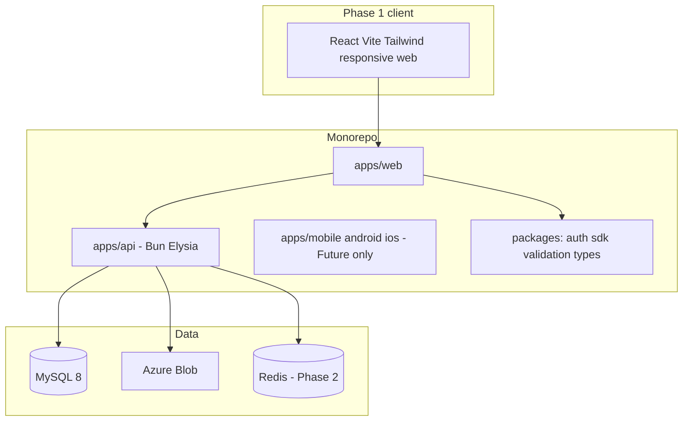

# Tech Stack

**Document:** 07-Tech-Stack  
**Product:** SocietyHub  
**Version:** 1.0  
**Related:** [Architecture](03-Architecture.md), [Database](04-Database.md), [DevOps](../devops/README.md), [PRD](02-PRD.md)

This document is the **single explanation of what we use and why**. Detailed system design stays in Architecture; schemas in Database; deploy runbooks in `devops/`.

---

## 1. At a glance

| Layer | Choice | Phase |
|-------|--------|--------|
| Style | Modular monolith | 1+ |
| Monorepo | Turborepo + Bun workspaces | 1+ |
| Language | TypeScript (strict) | 1+ |
| API | Bun + Elysia + Zod | 1+ |
| Database | **MySQL 8** + Drizzle ORM | 1+ |
| Web | React + Vite + Tailwind (+ headless/Radix) | 1+ |
| Auth | Mobile OTP (MSG91) + Google SSO + PIN | 1 |
| Files | Azure Blob (photos/videos) | 1 |
| Speech | Browser Web Speech API (voice-to-text) | 1 |
| Hosting | Azure (Container Apps, Static Web Apps, MySQL Flexible) | After Phase 1 code |
| Jobs / cache | Redis 7 + BullMQ | 2 |
| Email | Resend | 2 |
| Push | Firebase Cloud Messaging (web) | 2 |
| Payments | Razorpay + manual cash/cheque/NEFT | 2 |
| Native mobile | Flutter (`apps/mobile/android`, `apps/mobile/ios`) | Future |
| Tests | Vitest + Playwright | When implementing |

**Client for Phase 1:** one **simple responsive web app** (phone browser + desktop). Not Flutter.

---

## 2. Why this stack

| Decision | Rationale |
|----------|-----------|
| **Modular monolith** | Fast Phase 1 delivery; clear modules; avoid microservices/K8s cost and complexity |
| **Bun + TypeScript** | One language across API and tooling; fast local DX |
| **Elysia + Zod** | Typed HTTP API with shared validation schemas |
| **MySQL 8** | Lightweight to run locally (Docker); familiar; Azure Database for MySQL for cloud; Drizzle supports MySQL well |
| **Drizzle** | Type-safe SQL migrations/schemas without heavy ORM magic |
| **React + Vite + Tailwind** | Simple, responsive UI for non-technical users; mobile browser first |
| **Azure** | Aligns with Blob storage; Container Apps scale-to-zero saves cost on staging |
| **MSG91 + Google** | India OTP + SSO for easy login; PIN for quick re-entry |
| **Defer Redis/Razorpay/FCM** | Not needed until Phase 2 billing/notices/SLA |

---

## 3. Application layers



| Path | Role |
|------|------|
| `apps/api` | Backend modular monolith |
| `apps/web` | Responsive web UI |
| `apps/mobile/*` | Placeholders for future Flutter Android/iOS |
| `packages/*` | Shared auth helpers, SDK, Zod schemas, types |
| `devops/` | Docker + Azure staging/production (cost-aware) |
| `docs/` | Product and technical specification |

---

## 4. Backend

- **Runtime:** Bun  
- **Framework:** Elysia (feature modules: auth, society, resident, complaints, …)  
- **Validation:** Zod at API boundary (`packages/validation`)  
- **Patterns:** repository + service + thin routes; DTOs (not raw DB rows)  
- **Auth:** OTP, Google SSO, hashed PIN; session/JWT via `packages/auth`  
- **Tenancy:** every business query scoped by `tenant_id`

---

## 5. Data

- **Engine:** MySQL 8 (`utf8mb4`)  
- **ORM:** Drizzle (MySQL dialect)  
- **Local:**  
  ```bash
  docker compose -f devops/docker/docker-compose.yml up mysql
  ```  
  Default: host `localhost:3306`, database/user/password `societyhub`  
- **Cloud:** Azure Database for MySQL Flexible Server (Burstable SKUs for cost)  
- **IDs:** `CHAR(36)` UUID strings; timestamps `DATETIME(3)` UTC  
- Full table list: [04-Database.md](04-Database.md)

Avoid PostgreSQL-only types (arrays, JSONB). Use MySQL `JSON` or normalized tables when needed.

---

## 6. Frontend (Phase 1)

- **React + TypeScript + Vite + Tailwind**  
- **UX:** simple — few screens, one primary action, large tap targets  
- **Responsive:** ~375px phone browser + desktop  
- **Live:** login, onboard, Complaints (raise/list/status, voice, media)  
- **Coming soon in nav:** Bills, Payments, Notices, Dashboard, etc. (no fake APIs)  
- Call API only through `packages/sdk`

UI rules: [PRD §5](02-PRD.md).

---

## 7. Integrations

| Service | Use | Phase |
|---------|-----|--------|
| MSG91 | SMS OTP | 1 |
| Google OAuth | SSO login | 1 |
| Azure Blob | Complaint photos/videos | 1 |
| Web Speech API | Voice-to-text on description | 1 (browser; graceful fallback) |
| Resend | Transactional email | 2 |
| Firebase FCM | Web push | 2 |
| Razorpay | Online maintenance payments | 2 |
| Redis + BullMQ | SLA jobs, async notify | 2 |

---

## 8. Hosting and DevOps (Azure)

Cost-aware defaults — details in [`devops/COST.md`](../devops/COST.md):

| Piece | Choice |
|-------|--------|
| Web | Azure Static Web Apps (preferred) |
| API | Azure Container Apps (staging min replicas **0**) |
| DB | Azure Database for MySQL Flexible Burstable |
| Registry | ACR Basic (shared) |
| Secrets | Key Vault per env |
| Packaging | Docker (`devops/docker/`) — same image tag staging → production |

**No AKS** for Phase 1 / early Phase 2.  
**Deploy after** Phase 1 application development is ready for staging UAT.

---

## 9. Testing (when coding)

| Tool | Use |
|------|-----|
| Vitest | Unit / integration (auth, complaints; Phase 2 also payments) |
| Playwright | Critical web flows (login, raise complaint) |

---

## 10. Explicitly out of Phase 1 stack

- Flutter / native Android & iOS app code (folders are placeholders only)  
- WhatsApp Business API  
- Kubernetes / microservices  
- Redis required in Phase 1 (optional later)  
- Razorpay / Resend / FCM until Phase 2  

---

## 11. Related docs

| Doc | Content |
|-----|---------|
| [03-Architecture.md](03-Architecture.md) | Modules, tenancy, security, diagrams |
| [04-Database.md](04-Database.md) | Tables and columns |
| [06-Coding-Standards.md](06-Coding-Standards.md) | How we write code |
| [../devops/README.md](../devops/README.md) | Staging, production, Docker |
| [../AGENTS.md](../AGENTS.md) | Agent rules + skill map |
